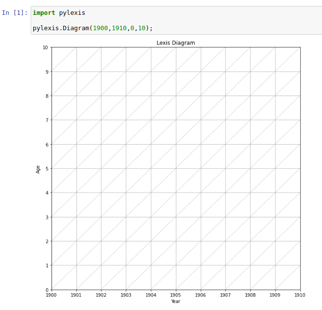
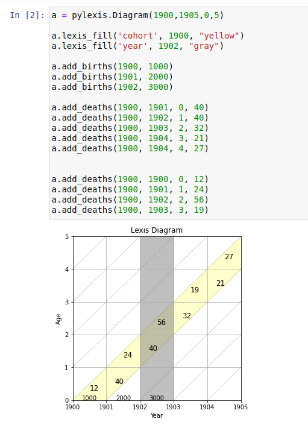
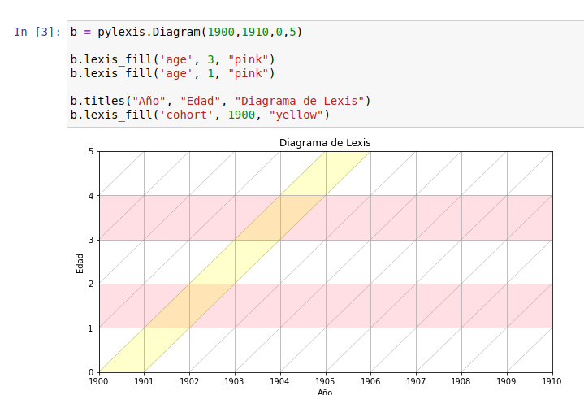

# PyLexis

`PyLexis` is a tool to easily plot Lexis Diagrams within Python. It is based on [`matplotlib`](https://matplotlib.org/) and inspirated in 
[LexisPlotR](https://github.com/ottlngr/LexisPlotR).

### What is a Lexis Diagram?

> In demography a Lexis diagram (named after economist and social scientist Wilhelm Lexis) is a two dimensional diagram that is used to represent events 
(such as births or deaths) that occur to individuals belonging to different cohorts. Calendar time is usually represented on the horizontal axis, while 
age is represented on the vertical axis. (<https://en.wikipedia.org/wiki/Lexis_diagram>)

### Installation

```
pip install pylexis
```

### Using PyLexis

First import the package and create a **Diagram** object with the following arguments:

_initial year_, _final_year_, _first_age_, _last_age_

``` py
import pylexis
diagram = pylexis.Diagram(1900, 1920, 0, 10)
```

This returns a basic diagram:



Then you have a few methods to interact with the graph:
- **pylexis.Diagram.titles(_x_label, y_label, title_)**: Add title and axis labels.
---
- **pylexis.Diagram.lexis_fill(_target, value, color_)**: Highlight a certain age, year or cohort in the grid.

        Parameters
        ----------
        target: {'age', 'year' or 'cohort'}
        value: int with the value of the target selected.
        color: str with the colour to fill.
---
- **pylexis.Diagram.add_births(_year, value_)**: Draw number of births in a specific year.
---
- **pylexis.Diagram.add_deaths(_cohort, year, age, value_)**: Draw number of deaths in a specific year for a specific cohort.


        Parameters
        ----------
        cohort: Year of the cohort.
        year: int with year of deaths.
        age: int with age at the time of deaths. Deaths can be before or after birthdays.
        value: int with the number of deaths.

Here are some examples:




### FAQ
Just ask me what you need!
