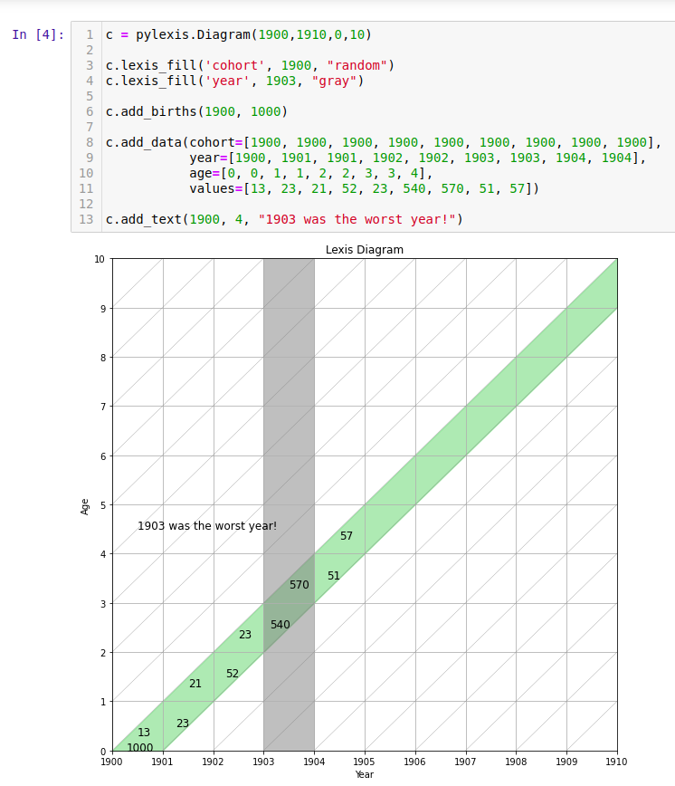

# PyLexis

`PyLexis` is a tool to easily plot Lexis Diagrams within Python. It is based on [`matplotlib`](https://matplotlib.org/) and inspirated in
[LexisPlotR](https://github.com/ottlngr/LexisPlotR).

### What is a Lexis Diagram?

> In demography a Lexis diagram (named after economist and social scientist Wilhelm Lexis) is a two dimensional diagram that is used to represent events
(such as births or deaths) that occur to individuals belonging to different cohorts. Calendar time is usually represented on the horizontal axis, while
age is represented on the vertical axis. (<https://en.wikipedia.org/wiki/Lexis_diagram>)

### Installation

```
pip install pylexis
```

### Using PyLexis

First import the package and create a **Diagram** object with the following arguments:

_initial year_, _final_year_, _first_age_, _last_age_

``` py
import pylexis
diagram = pylexis.Diagram(1900, 1910, 0, 10)
```

This returns a basic diagram:


Then you have a few methods to interact with the graph:

#### Styling
- **pylexis.Diagram.set_font(_size, weight_)**: Set font size and weight.

        Parameters
        ----------
        size: int with font size in points (default 12, range[1-1000]).
        weight: str with font weight {'light', 'regular', 'book', 'medium', 'bold', 'heavy'}.

- **pylexis.Diagram.set_font_retroactively(_size, weight_)**: Idem _set_font()_. Use this to update the font after plotting and standardize the graph.

- **pylexis.Diagram.set_aspect(_aspect_)**: Set aspect ratio of the grid.

        Parameters
        ----------
        aspect: str or float with aspect ratio of the grid. Use 'square' for square cells, 'auto' for equal sized steps on both axes, or a float for a custom ratio.

---
#### Graphing Data
- **pylexis.Diagram.titles(_x_label, y_label, title_)**: Add title and axis labels.

- **pylexis.Diagram.lexis_fill(_target, value, color, alpha_)**: Highlight a certain age, year or cohort in the grid.

        Parameters
        ----------
        target: {'age', 'year' or 'cohort'}
        value: int with the value of the target selected.
        color: str with the colour to fill. Use 'random' to fill with a random color.
        alpha: float with the transparency of the fill. 0 is transparent, 1 is opaque.

- **pylexis.Diagram.add_births(_year, value_)**: Draw number of births in a specific year.

- **pylexis.Diagram.add_deaths(_cohort, year, age, value_)**: Draw number of deaths in a specific year for a specific cohort.

        Parameters
        ----------
        cohort: Year of the cohort.
        year: int with year of deaths.
        age: int with age at the time of deaths. Deaths can be before or after birthdays.
        value: int with the number of deaths.

- **pylexis.Diagram.add_text(_year, age, value_)**: Draw a free text in the grid.

        Parameters
        ----------
        year: int with year of the text point.
        age: int with age of the text point.
        value: string-castable value of the text point.

- **pylexis.Diagram.add_data(_cohort, year, age, values_)**: Add a list of data points to the Lexis Diagram.

        Parameters
        ----------
        cohort: list[int] with year of the cohorts 
        year: list[int] with years of deaths of each data points.
        age: list[int] with age of each data points.
        values: list of string-castable values of each data points.

- **pylexis.Diagram.add_data_unsafe(_year, age, values_)**: Idem _add_data()_ without checking if the data fits in the grid.

        Parameters
        ----------
        year: list[int] with years of the data points.
        age: list[int] with age of the data points.
        values: list of string-castable values of the data points.
---
#### Export Data
- **pylexis.Diagram.save(_filename_)**: Save the Lexis Diagram as an image file.

        Parameters
        ----------
        filename: str with the name of the file to save.

### Examples

#### Basic Diagram


#### Add Data Points and Texts


### How to contribute to the project?
Please check the [how to contribute](CONTRIBUTING.md) instructions.

### FAQ
Just ask me what you need!
